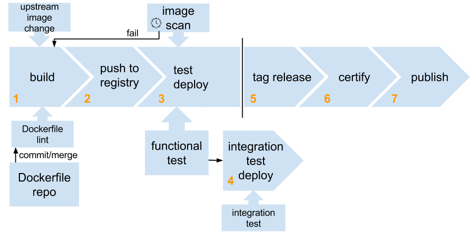

# OpenShift Image Build Pipeline

A container image automated build pipline based on OpenShift V3 and Jenkins to build, deploy, test and promote.

1. A new build may be triggered by a source control change, a failed image scan, an upstream (FROM) image change or manually. A Dockerfile lint test is run before the build begins and may optionally gate the build.
1. New image is pushed to internal OpenShift registry. Image tagged with incremented build number.
1. Image is deployed for testing. Single-image functional testing is performed. Deployment is scanned periodically for vulnerabilities. If scan fails a new build is triggered.
1. An optional integration test phase of dependent images or services. Integration deployment may be a vm-based platform such as Atomic Enterprise.
1. Automation is gated on manual tagging for release. The tag release job triggers certification and publication.
1. Submit for certification.
1. Publish to public registry. Image is available pull using new release tag.

## OpenShift

OpenShift is a hosted service. You may want to host an instance of OpenShift yourself either because you want a development environment or you do not have access to a hosted environment. Refer to the [Installation methods](https://docs.openshift.org/latest/getting_started/administrators.html#installation-methods).

## Workflow Requirements

* access to OpenShift
* configured OpenShift registry
* created an OpenShift project
* access to `oc` client. For remote OpenShift client use the CLI binary can be downloaded or run from a container.

        $ [sudo] docker run -it --name origin --entrypoint bash openshift/origin

## Setup

1. Add the `edit` role to the `default` service account in the `<PROJECT_NAME>` project. This is so Jenkins can access the OpenShift environment using a service account token.

        $ oc policy add-role-to-user edit system:serviceaccount:<PROJECT_NAME>:default

1. Upload the Jenkins master template.

        $ oc create -f https://raw.githubusercontent.com/aweiteka/jenkins-ci/http-insecure/openshift/jenkins-master-ephemeral.json

1. Start the Jenkins master. This will build and deploy the server so it will take several minutes. Replace `<YOUR_PASSWORD>`.

        $ oc new-app jenkins-master -p JENKINS_PASSWORD=<YOUR_PASSWORD>

1. Create the application. This creates a whole pile of resources (build config, image streams, test deployment, service)

        oc new-app https://github.com/example/app.git --context-dir=path/to/dockerfile --name=<YOUR_APPLICATION_NAME>

1. Create a DNS route for your application

        oc expose service <YOUR_APPLICATION_NAME>

## Jenkins setup

In the OpenShift web UI Overview click on the Jenkins service link and login with username "admin" and the password you selected when deployed. (The default is "password" if you did not select your own.) Note there may be a few jobs already created. For this workflow these will not be used.

Now we're ready to create the jobs in the Jenkins master. We'll use Jenkins Job builder to define the jobs then render them using a CLI tool.

1. Copy the Jenkins Job Builder template and config directory from this repository to your source repository. The directory should look something like this.

        ├── config
        │   └── jenkins-jobs.ini
        ├── Dockerfile
        ├── ...
        └── jenkins-jobs.yaml

1. Edit the jenkins-jobs config file `config/jenkins-jobs.ini` changing the jenkins master route address. **Do NOT** add `jenkins-jobs.ini` to source control. It has your credentials. The password must be the admin user token. In the jenkins web UI in upper-right corner navigate Jenkins Admin pulldown > Configure > Show API Token.
1. Run the Jenkins Job Builder tool to upload jobs to the Jenkins master. Run the container from the same directory of the `jenkins-jobs.yaml` file.

        [sudo] atomic run aweiteka/jenkins-job-builder

1. Each time you want to make a change to a job, run this tool again to update the changes in the Jenkins master.

## Customizing the automation

TBD

## Migrating to another OpenShift Instance

If you were working on a local development environment you can migrate your work to a hosted environment.

1. Export your template. We're exporting all resources as template. You may pass in the label option to select certain resources such as `-l app=mongodb`.

    oc export all --all -o json --as-template myproject > myproject.json

1. Logout of the local environment.

        oc logout

1. Try to login to the hosted environment.

        oc login https://<openshift_console_url>

1. You'll get a 404 login error, instructing you to get an API token first. Visit the URL and copy the login command with the token.

        oc login --token=<token> --server=https://<openshift_api_url>

1. Import on the other Openshift server

        oc new-app -f myproject.json

1. Update your Jenkins endpoint so you can upload the jenkins jobs to the new jenkins server. Get the Jenkins master URL:

        oc get route jenkins

1. Update `config/jenkins-jobs.ini` file with the URL from step 1.
1. Upload the jobs.

        sudo atomic run aweiteka/jenkins-job-builder

## Notes

* Delete resources in bulk

        oc delete all -l <FOO=BAR>

* Trigger OpenShift web hook remotely

        curl -X POST <openshift_webhook_url> [--insecure]

* Image scanning. Assumes image contents in `/tmp/image-content`

        export OSCAP_PROBE_ROOT=/tmp/image-content
        sudo oscap oval eval --report /tmp/oscap.html --results /tmp/oscap.xml http://www.redhat.com/security/data/oval/Red_Hat_Enterprise_Linux_7.xml

* Inspect image

        oc get istag <imagestream>:<tag> -o yaml

* Get image labels

        oc get istag centos:centos7 -o template -t {{.image.dockerImageMetadata.ContainerConfig.Labels}}

* Dockerfile lint remote Dockerfile

        docker run -it --rm projectatomic/dockerfile-lint bash -c 'git clone https://github.com/projectatomic/atomicapp.git && dockerfile_lint -f atomicapp/Dockerfile'

## Troubleshooting

1. "My image won't run on OpenShift."

    Is it running as root? OpenShift will not allow running as root. You may need to update your image. See ["Support arbitrary user ids"](https://access.redhat.com/documentation/en/openshift-enterprise/version-3.0/openshift-enterprise-30-creating-images/chapter-1-guidelines).

1. Monitoring and debugging tips

        oc get events -w         # tail openshift events
        oc get builds            # list builds
        oc build-logs <build>    # view a build log
        oc get pods              # list pods
        oc logs <pod>            # view a pod log
        oc exec -it <pod> bash   # enter a pod interactively to debug
        oc get dc                # list deployment configurations
        oc edit dc <deploy_conf> # edit a deployment configuration
